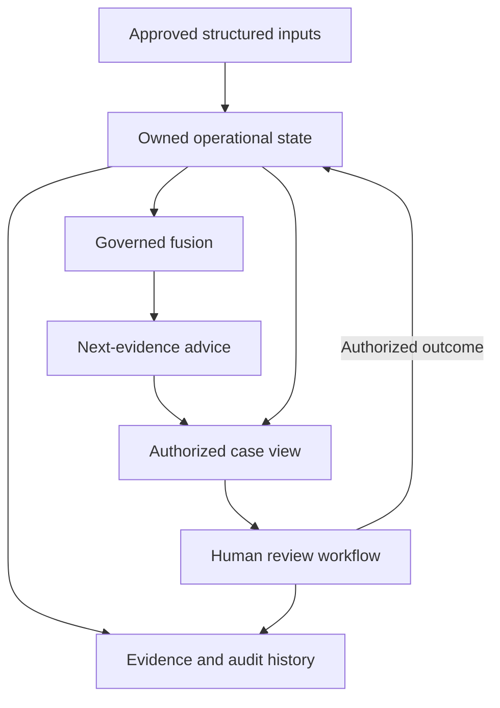

# ROS Brain integration baseline

Status: **ENGINEERING BASELINE — SHADOW_ONLY — RELEASE NOT APPROVED**

- Review date: 2026-09-07.
- Observed source baseline: `8096312169dc7f769a45b419d5678b5bd5f461ad` (`8096312`).
- Delivery owner, on-call owner, and rollback owner: **Mohamed Qahtan**.
- Architecture: the accepted [Modular Monolith decision](../02-architecture/adr/ADR-001-modular-monolith.md).
- Delivery sequence: [daily delivery plan](daily-delivery-plan.md).

ROS Brain belongs inside the existing ROS architecture as a group of bounded analysis and recommendation modules. It does not become the owner of incident state, human safety authority, source permissions, or external execution. Cohesion means that the modules share explicit identities, versioned contracts, acknowledged outcomes, and a reconstructable history.

The founder reported that AWS resources were deleted on 2026-09-06. That report changes the operational baseline; it does not delete the source code. Previously recorded Frankfurt resources, image receipts, and environment reports are historical evidence, not proof of a current running service or surviving archive. This review did not call live AWS APIs. Cloud spending, infrastructure apply, deployment, and external service activation are outside this increment.

## Evidence and status vocabulary

| Status | Meaning in this baseline |
|---|---|
| Source observed | An implementation or contract exists at the baseline SHA; this alone does not prove current runtime operation. |
| Candidate increment | Work included in the current change; the verification section records its local acceptance and remaining boundaries. |
| Integration gap | A required connection or invariant was not demonstrated in the inspected source. |
| Future cycle | An ordered follow-up outcome, not a completed capability or a calendar guarantee. |

Existing test files are evidence of intended behavior. Only freshly executed checks may establish the candidate's verified result. No historical test count or cloud receipt is promoted into a new acceptance result.

## Cohesive architecture and ownership

The body analogy describes responsibility, not a requirement for separate deployed microservices.

| Body analogy | ROS module and ownership | Observed source seam |
|---|---|---|
| Senses | Signal ingestion validates source metadata, chronology, vocabulary, and replay boundaries. Evidence storage owns object integrity and lifecycle. | `apps/api/src/ros-eye/signal-ingestion.ts`; `apps/api/src/evidence/evidence-service.ts` |
| Nervous system | Internal contracts and durable outbox delivery carry versioned facts and acknowledgement outcomes. A retry cannot grant new authority or repeat a logical action. | `packages/contracts/src/`; `apps/api/src/runtime/outbox-worker-runtime.ts` |
| Operational core | RoadEvent domain/application services own event state, concurrency, severity changes, and closure authorization. | `packages/domain/src/road-event/road-event.ts`; `apps/api/src/application/road-event-application.ts` |
| Human safety lifecycle | HumanSafetyCase contracts define human authority and revision-bound transitions; the contact service owns durable contact-session progression. | `packages/contracts/src/human-safety.ts`; `apps/api/src/ros-eye/contact-orchestration.ts` |
| Brain | Governed fusion explains structured evidence and uncertainty. The next-evidence advisor translates missing information into bounded review suggestions. | `apps/api/src/ros-eye/governed-safety-fusion.ts`; `packages/contracts/src/safety-fusion.ts`; current advisor increment |
| Memory | Evidence and audit services retain decision provenance and history. Advice cannot rewrite evidence or its own source recommendation. | `apps/api/src/evidence/`; `database/migrations/0009_ros_eye_safety_fusion_governance.sql` |
| Protective response | Existing Human Safety rules and human operational workflows retain the urgent response path when analysis is absent, stale, blocked, or unavailable. | `packages/contracts/src/human-safety.ts`; `apps/api/src/http/human-safety-http.ts` |
| Immune system | Authentication, tenant/purpose authorization, consent, source authority, and privacy policy decide permitted access and execution. | `apps/api/src/http/actor-resolver.ts`; `apps/api/src/ros-eye/privacy-security-oversight.ts` |
| Communication and action | API, application, dashboard, and approved adapters display facts and execute only their separately authorized actions. Sending is distinct from acknowledgement and completion. | `apps/api/src/http/`; `apps/operations-dashboard/src/human-safety-gateway.ts` |

The intended analysis flow and the independent human path are:

The state-to-fusion runtime connection is a documented integration gap below. The diagram is the intended composition; it is not evidence that every connection is already operational.

### Authority and data rules

1. The brain reads an authorized context and produces a recommendation. It cannot transition a case, lower severity, close a road or case, contact a person, collect evidence, dispatch a responder, or actuate a vehicle.
2. The current operational aggregate is authoritative for severity and state. Historical recommendation severity cannot replace it. Human Safety's independent review path stays visible when advice abstains.
3. Contact, case, evidence, and indicator changes have distinct ownership. Their versions must be explicitly bound before a recommendation can be described as based on the current snapshot.
4. An authenticated actor and successful tenant/purpose resource authorization precede case advice. Advice is not a new authorization grant, and an auditor's ability to read does not confer action authority.
5. Consent or evidence acquisition permission must come from the existing authoritative boundary. The current case read does not provide a collection consent receipt or acquisition approval.
6. Advice contains structured codes, quality categories, version/time metadata, and a recommendation reference. Raw medical narrative, conversations, contact details, coordinates, secrets, source URLs, and arbitrary source text do not belong in the advisory contract.
7. Human resolution and uncertainty authorizations retain the existing version, evidence, connectivity, role, and expiry checks. New advice must not weaken those checks or imply that unknown context has been resolved.

## Observed foundations and integration gaps

| ID | Boundary | Source observed at `8096312` | Gap and required next evidence |
|---|---|---|---|
| BRAIN-01 | Current input snapshot | Fusion binds guard results to a positive `inputVersion`; recommendations record evaluation time and a fingerprint. | No contract binds that version to RoadEvent, contact, evidence, and indicator versions. Define and persist an explicit input snapshot; test correction, revocation, and concurrent update invalidation. |
| BRAIN-02 | Durable fusion runtime | Governed fusion validates authoritative evidence receipts; a recommendation table and a scoped HTTP reader exist. | No production runtime caller/writer was found in the inspected source. Add an authorized snapshot loader, governed invocation, and durable append-only writer with idempotency, restart, and failure evidence. |
| BRAIN-03 | Case projection | HTTP maps a RoadEvent and contact backing into `HumanSafetyCaseView`. | `severityAssessmentVersion` is projected from `event.version`, `evidenceRevision` from provenance count, and `indicatorRevision` as zero. Those values do not prove independent revision histories. Replace projections with authoritative revisions before claiming snapshot validity. |
| BRAIN-04 | Source provenance | The case reader exposes evidence IDs, status, integrity categories, and reception time. | It maps evidence objects to `INFRASTRUCTURE` and has no acquisition receipt in its backing. Do not claim source independence, acquisition permission, or current source consent from that view. |
| BRAIN-05 | Runtime health | Readiness/resilience components exist; the case view has health fields. | The inspected case projection hardcodes `HEALTHY`. Bind displayed health to observed dependency/connectivity evidence before operational acceptance. |
| BRAIN-06 | Full incident journey | Incident, evidence, contact, API, and dashboard code exists. | Re-run one current-candidate journey across actual module seams, including duplicate input, human ownership, acknowledgement, and closure rejection/acceptance. Separate simulated external handoffs from live ones. |
| BRAIN-07 | Per-person safety | The HumanSafetyCase contract includes a RoadEvent link. | The current HTTP projection uses the event ID as the safety case ID. Prove the required cardinality and independent lifecycle for multiple people before claiming person-level completeness. |
| BRAIN-08 | Recovery and restart | Runtime, outbox, PostgreSQL, and Redis recovery code and checks exist. | Current local and deployment readiness must be freshly demonstrated; prior cloud success does not establish a running environment after deletion. |
| BRAIN-09 | Release archive | REL-013 and an external immutable archive workflow are specified. | Current archive availability and new receipt acceptance were not verified. Local files and GitHub's 90-day transport artifacts cannot close the at-least-365-day release evidence requirement. |
| BRAIN-10 | Advisor presentation | Existing case responses and dashboard already carry fusion recommendations and missing-evidence flags. | Current candidate adds a bounded advisor to those existing read/display seams; local acceptance is recorded below. |

The first two gaps are prerequisites for a claim of current, durable brain integration. The remaining gaps are tracked separately so that one daily slice cannot silently become a claim of full operational readiness.

## Current candidate: next-evidence advice

This increment adds a versioned, read-only `nextEvidenceAdvice` contract and planner to authorized case reads and the operations dashboard. It leaves fusion scoring and state-changing interfaces unchanged.

| Contract property | Required meaning |
|---|---|
| `status: SUGGESTED` | Bounded review suggestions can be displayed from the available structured context. It does not certify a complete current snapshot or permit execution. |
| `status: ABSTAIN` | The advisor cannot justify usable suggestions under its contract. Existing operational state and human review remain available. |
| `mode: SHADOW_ONLY` | Advice is an observable analysis result, without real-world execution authority. |
| `activationAuthorized: false` | The result does not authorize activation of any proposed action. |
| `sourceSnapshotStatus: UNVERIFIED` | This increment cannot prove current input snapshot identity; passing age checks does not change this property. |
| `collectionPermitted: false` | No camera request, sensor query, contact attempt, evidence export, or acquisition is authorized by this result. |

The planner uses injected server time, preserves the source recommendation's evaluation time, and expires advice exactly five minutes after that evaluation (`NEXT_EVIDENCE_LIFETIME_MS`). This conservative display lifetime is an engineering rule, not a measured clinical or field-validity threshold. Refreshing the page does not renew an old recommendation. A future evaluation timestamp, invalid time, known incompatible scope/severity, newer contact update, or newer evidence must not be displayed as compatible current advice. The browser updates the read-only advice panel on its own clock while a network refresh is pending.

Known-newer-context checks are conservative rejection checks. They cannot detect every correction or revocation with the existing projection and therefore cannot prove `VERIFIED` snapshot status.

Human review is expressed separately through `reviewPriority`, independently of fusion availability. S3/S4, known non-response/unreachable/disconnected contact, escalation, or an overdue deadline retain urgent review. At most three structured suggestions are shown, prioritizing contact outcome and conflicting evidence before other information gaps. Missing guard clearance cannot become a recommendation to bypass a guard. Other suggestions concern a recent trusted source, independent corroboration, device health, location quality, or source integrity through existing authorized workflows. The advisor does not invent information-gain scores, acquisition cost savings, field accuracy, or a permission receipt.

### Candidate acceptance and verification

Required evidence covers the planner's bounded outputs, API authorization and read-only behavior, original severity preservation, unavailable/stale/future/mismatched recommendations, known newer context, no sensitive-data disclosure, and Arabic dashboard rendering of advisory limits and expiry.

Verification date: **2026-09-07 UTC / 2026-09-08 Asia/Riyadh**. Environment: Node **24.19.0**, root package manager invoked through Corepack **pnpm 9.15.4**, existing frozen lockfile. The CI Node 22 environment was not executed locally.

| Check | Fresh result |
|---|---|
| Baseline affected tests | Exit 0; 15/15 existing HTTP, governed-fusion, and dashboard workflow tests passed. |
| Red acceptance proof | The initial planner failed both new behavior assertions: bounded suggestions and independent urgent human review. Implementation then made both pass. |
| `corepack pnpm build` | Exit 0; all five build tasks successful. |
| Focused compiled tests: `next-evidence`, `human-safety-http`, `governed-safety-fusion`, `human-safety-browser-workflow` | Exit 0; 30/30 passed, zero skipped. |
| `corepack pnpm test` | Exit 0; 522/522 passed: API 449, dashboard 30, mobile 36, domain 7; zero skipped. |
| `corepack pnpm verify` | Exit 0; repository/composition/retention/negative-gate checks passed, including 8/8 external-evidence unit tests. This is configuration/logic evidence, not a live archive receipt. |
| `corepack pnpm typecheck` and `corepack pnpm lint` | Both exit 0; all seven tasks successful in each command. |
| `git diff --check` and documentation link resolution | Exit 0; no whitespace errors or missing relative documentation links. |

The code/test manifest SHA-256 is `72217362fe9335d80c94621c9b46aa00c104361e29dee888ed395df486f9db69`. It hashes sorted lines `SHA256(file bytes)`, two spaces, repository-relative path, newline, for the nine TypeScript files changed from the recorded baseline. Documentation is excluded to avoid a self-referential digest. The Git branch records the complete candidate identity. All gates were invoked again after the accessibility correction; Turbo reused unchanged tasks, and the changed dashboard tests executed again successfully.

Acceptance covers bounded suggestions, no input mutation or severity replacement, role/tenant/purpose checks before backing reads, malformed/stale/future sources, known newer contact/evidence/audit context, guard and quarantine abstention, no arbitrary source-text propagation into advice, display expiry and legacy response compatibility. API backing stores and external channels in these tests are local doubles or simulations. The existing fusion scoring rules were not changed.

An independent read-only review found one accessibility issue: the advice clock reinserted an unchanged assertive alert every second. The fix caches rendered advice and replaces the panel only when its content changes, retaining independent expiry checks. The reviewer confirmed that correction. No additional authorization, expiry, or snapshot-honesty blocker was reported. A graphical screen-reader session remains unverified.

Result: **LOCAL ADVISOR INCREMENT VERIFIED; RELEASE NOT APPROVED.** No live PostgreSQL/Redis/object-store integration, graphical browser session, new CI run, external archive receipt, deployment, or field measurement was established in this cycle. Snapshot identity remains `UNVERIFIED`; BRAIN-01/02 remain open. The next handoff is the authoritative snapshot contract and invalidation behavior.

## Authoritative snapshot contract progress

Cycle 2 resumed from branch candidate `6d1c94afe8e0d947b6fdd87d964a7c0c7a03a2dd` with `main` at `8096312169dc7f769a45b419d5678b5bd5f461ad`. The increment defines an executable, fail-closed contract that binds a recommendation fingerprint and fusion input version to one snapshot digest plus independently owned case, severity, contact, evidence, and indicator revision/digest pairs.

The assessment returns `VERIFIED` only when scope, chronology, recommendation identity, snapshot identity, and every current component binding match exactly. A newer revision, a corrected or revoked value represented by a changed digest, contact creation/removal, scope drift, malformed receipt, or source mismatch cannot remain verified. Missing proof stays `UNVERIFIED`; it is never inferred from timestamps or evidence count.

Fresh local verification passed: 4/4 new snapshot tests, 13/13 focused snapshot/advisor tests, and 526/526 workspace tests. Relevant TypeScript builds and no-emit checks passed. Repository/composition/retention/negative gates passed, including 8/8 external-evidence logic tests. The three-file code/test manifest SHA-256 is `adde9b43fdb17306f5f03a84bd9ec60c82199168a280174710a7252291376901`.

Result: **PARTIAL BRAIN-01 CONTRACT VERIFIED; DURABLE CAPTURE REMAINS OPEN.** This contract does not issue authoritative revisions or digests. No tenant/purpose-scoped durable snapshot writer/reader, PostgreSQL concurrency test, migration, recommendation persistence, CI run, external archive receipt, merge, deployment, or operational readiness was established. Those limits keep BRAIN-01 and BRAIN-02 open.

Delivery uses review branch `codex/ros-brain-next-evidence-daily`. Opening a PR currently starts workflows whose successful completion triggers `.github/workflows/archive-ci-evidence.yml`, including AWS credential acquisition and S3/KMS archive operations. Therefore this cycle saves the branch for review without opening a PR or changing the archival gates. A reviewed no-spend workflow decision is needed before initiating that path; the branch push itself does not match the existing `push` workflow triggers, which target `main`.

## Release and pilot boundaries

The existing [release gates](../09-reliability/operational-readiness-and-release-gates.md), [evidence contract](../09-reliability/ci-evidence-contract.md), [artifact retention policy](../10-engineering/artifact-retention.md), [pilot stop criteria](../07-pilot/kpi-stop-criteria.md), and [shadow/rollback protocol](../07-pilot/shadow-canary-rollback.md) remain controlling.

- Daily local acceptance is not release acceptance. Mandatory results must remain exactly `success` on the same candidate head, reviewed base, and tested merge revision where required.
- A missing or unverified external archive receipt remains an open release gate. No retention, encryption, immutability, or provenance requirement is weakened to compensate for deleted AWS resources.
- A green build does not authorize a real pilot, dispatch, road intervention, camera program, or vehicle actuation.
- Controlled environment proposals and any future hosting choice require a concrete scope and cost decision before activation. This daily work creates no paid resource and runs no infrastructure apply or deployment.
- Rollback or forward-fix must preserve incident, evidence, and audit history. **Mohamed Qahtan** owns the decision and operational handoff.
