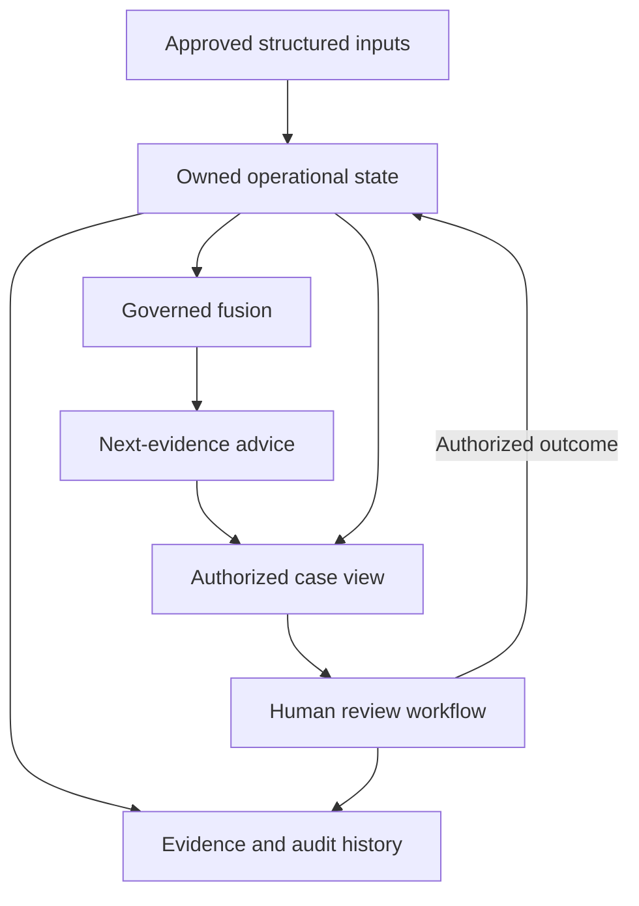

# ROS Brain integration baseline

Status: **ENGINEERING BASELINE — SHADOW_ONLY — RELEASE NOT APPROVED**

- Review date: 2026-09-07.
- Observed source baseline: `8096312169dc7f769a45b419d5678b5bd5f461ad` (`8096312`).
- Delivery owner, on-call owner, and rollback owner: **Mohamed Qahtan**.
- Architecture: the accepted [Modular Monolith decision](../02-architecture/adr/ADR-001-modular-monolith.md).
- Delivery sequence: [daily delivery plan](daily-delivery-plan.md).

ROS Brain belongs inside the existing ROS architecture as a group of bounded analysis and recommendation modules. It does not become the owner of incident state, human safety authority, source permissions, or external execution. Cohesion means that the modules share explicit identities, versioned contracts, acknowledged outcomes, and a reconstructable history.

The founder reported that AWS resources were deleted on 2026-09-06. That report changes the operational baseline; it does not delete the source code. Previously recorded Frankfurt resources, image receipts, and environment reports are historical evidence, not proof of a current running service or surviving archive. This review did not call live AWS APIs. Cloud spending, infrastructure apply, deployment, and external service activation are outside this increment.

## Evidence and status vocabulary

| Status | Meaning in this baseline |
|---|---|
| Source observed | An implementation or contract exists at the baseline SHA; this alone does not prove current runtime operation. |
| Candidate increment | Work included in the current change; the verification section records its local acceptance and remaining boundaries. |
| Integration gap | A required connection or invariant was not demonstrated in the inspected source. |
| Future cycle | An ordered follow-up outcome, not a completed capability or a calendar guarantee. |

Existing test files are evidence of intended behavior. Only freshly executed checks may establish the candidate's verified result. No historical test count or cloud receipt is promoted into a new acceptance result.

## Cohesive architecture and ownership

The body analogy describes responsibility, not a requirement for separate deployed microservices.

| Body analogy | ROS module and ownership | Observed source seam |
|---|---|---|
| Senses | Signal ingestion validates source metadata, chronology, vocabulary, and replay boundaries. Evidence storage owns object integrity and lifecycle. | `apps/api/src/ros-eye/signal-ingestion.ts`; `apps/api/src/evidence/evidence-service.ts` |
| Nervous system | Internal contracts and durable outbox delivery carry versioned facts and acknowledgement outcomes. A retry cannot grant new authority or repeat a logical action. | `packages/contracts/src/`; `apps/api/src/runtime/outbox-worker-runtime.ts` |
| Operational core | RoadEvent domain/application services own event state, concurrency, severity changes, and closure authorization. | `packages/domain/src/road-event/road-event.ts`; `apps/api/src/application/road-event-application.ts` |
| Human safety lifecycle | HumanSafetyCase contracts define human authority and revision-bound transitions; the contact service owns durable contact-session progression. | `packages/contracts/src/human-safety.ts`; `apps/api/src/ros-eye/contact-orchestration.ts` |
| Brain | Governed fusion explains structured evidence and uncertainty. The next-evidence advisor translates missing information into bounded review suggestions. | `apps/api/src/ros-eye/governed-safety-fusion.ts`; `packages/contracts/src/safety-fusion.ts`; current advisor increment |
| Memory | Evidence and audit services retain decision provenance and history. Advice cannot rewrite evidence or its own source recommendation. | `apps/api/src/evidence/`; `database/migrations/0009_ros_eye_safety_fusion_governance.sql` |
| Protective response | Existing Human Safety rules and human operational workflows retain the urgent response path when analysis is absent, stale, blocked, or unavailable. | `packages/contracts/src/human-safety.ts`; `apps/api/src/http/human-safety-http.ts` |
| Immune system | Authentication, tenant/purpose authorization, consent, source authority, and privacy policy decide permitted access and execution. | `apps/api/src/http/actor-resolver.ts`; `apps/api/src/ros-eye/privacy-security-oversight.ts` |
| Communication and action | API, application, dashboard, and approved adapters display facts and execute only their separately authorized actions. Sending is distinct from acknowledgement and completion. | `apps/api/src/http/`; `apps/operations-dashboard/src/human-safety-gateway.ts` |

The intended analysis flow and the independent human path are:

The state-to-fusion runtime connection is a documented integration gap below. The diagram is the intended composition; it is not evidence that every connection is already operational.

### Authority and data rules

1. The brain reads an authorized context and produces a recommendation. It cannot transition a case, lower severity, close a road or case, contact a person, collect evidence, dispatch a responder, or actuate a vehicle.
2. The current operational aggregate is authoritative for severity and state. Historical recommendation severity cannot replace it. Human Safety's independent review path stays visible when advice abstains.
3. Contact, case, evidence, and indicator changes have distinct ownership. Their versions must be explicitly bound before a recommendation can be described as based on the current snapshot.
4. An authenticated actor and successful tenant/purpose resource authorization precede case advice. Advice is not a new authorization grant, and an auditor's ability to read does not confer action authority.
5. Consent or evidence acquisition permission must come from the existing authoritative boundary. The current case read does not provide a collection consent receipt or acquisition approval.
6. Advice contains structured codes, quality categories, version/time metadata, and a recommendation reference. Raw medical narrative, conversations, contact details, coordinates, secrets, source URLs, and arbitrary source text do not belong in the advisory contract.
7. Human resolution and uncertainty authorizations retain the existing version, evidence, connectivity, role, and expiry checks. New advice must not weaken those checks or imply that unknown context has been resolved.

## Observed foundations and integration gaps

| ID | Boundary | Source observed at `8096312` | Gap and required next evidence |
|---|---|---|---|
| BRAIN-01 | Current input snapshot | Fusion binds guard results to a positive `inputVersion`; recommendations record evaluation time and a fingerprint. | No contract binds that version to RoadEvent, contact, evidence, and indicator versions. Define and persist an explicit input snapshot; test correction, revocation, and concurrent update invalidation. |
| BRAIN-02 | Durable fusion runtime | Governed fusion validates authoritative evidence receipts; a recommendation table and a scoped HTTP reader exist. | No production runtime caller/writer was found in the inspected source. Add an authorized snapshot loader, governed invocation, and durable append-only writer with idempotency, restart, and failure evidence. |
| BRAIN-03 | Case projection | HTTP maps a RoadEvent and contact backing into `HumanSafetyCaseView`. | `severityAssessmentVersion` is projected from `event.version`, `evidenceRevision` from provenance count, and `indicatorRevision` as zero. Those values do not prove independent revision histories. Replace projections with authoritative revisions before claiming snapshot validity. |
| BRAIN-04 | Source provenance | The case reader exposes evidence IDs, status, integrity categories, and reception time. | It maps evidence objects to `INFRASTRUCTURE` and has no acquisition receipt in its backing. Do not claim source independence, acquisition permission, or current source consent from that view. |
| BRAIN-05 | Runtime health | Readiness/resilience components exist; the case view has health fields. | The inspected case projection hardcodes `HEALTHY`. Bind displayed health to observed dependency/connectivity evidence before operational acceptance. |
| BRAIN-06 | Full incident journey | Incident, evidence, contact, API, and dashboard code exists. | Re-run one current-candidate journey across actual module seams, including duplicate input, human ownership, acknowledgement, and closure rejection/acceptance. Separate simulated external handoffs from live ones. |
| BRAIN-07 | Per-person safety | The HumanSafetyCase contract includes a RoadEvent link. | The current HTTP projection uses the event ID as the safety case ID. Prove the required cardinality and independent lifecycle for multiple people before claiming person-level completeness. |
| BRAIN-08 | Recovery and restart | Runtime, outbox, PostgreSQL, and Redis recovery code and checks exist. | Current local and deployment readiness must be freshly demonstrated; prior cloud success does not establish a running environment after deletion. |
| BRAIN-09 | Release archive | REL-013 and an external immutable archive workflow are specified. | Current archive availability and new receipt acceptance were not verified. Local files and GitHub's 90-day transport artifacts cannot close the at-least-365-day release evidence requirement. |
| BRAIN-10 | Advisor presentation | Existing case responses and dashboard already carry fusion recommendations and missing-evidence flags. | Current candidate adds a bounded advisor to those existing read/display seams; local acceptance is recorded below. |

The first two gaps are prerequisites for a claim of current, durable brain integration. The remaining gaps are tracked separately so that one daily slice cannot silently become a claim of full operational readiness.

## Current candidate: next-evidence advice

This increment adds a versioned, read-only `nextEvidenceAdvice` contract and planner to authorized case reads and the operations dashboard. It leaves fusion scoring and state-changing interfaces unchanged.

| Contract property | Required meaning |
|---|---|
| `status: SUGGESTED` | Bounded review suggestions can be displayed from the available structured context. It does not certify a complete current snapshot or permit execution. |
| `status: ABSTAIN` | The advisor cannot justify usable suggestions under its contract. Existing operational state and human review remain available. |
| `mode: SHADOW_ONLY` | Advice is an observable analysis result, without real-world execution authority. |
| `activationAuthorized: false` | The result does not authorize activation of any proposed action. |
| `sourceSnapshotStatus: UNVERIFIED` | This increment cannot prove current input snapshot identity; passing age checks does not change this property. |
| `collectionPermitted: false` | No camera request, sensor query, contact attempt, evidence export, or acquisition is authorized by this result. |

The planner uses injected server time, preserves the source recommendation's evaluation time, and expires advice exactly five minutes after that evaluation (`NEXT_EVIDENCE_LIFETIME_MS`). This conservative display lifetime is an engineering rule, not a measured clinical or field-validity threshold. Refreshing the page does not renew an old recommendation. A future evaluation timestamp, invalid time, known incompatible scope/severity, newer contact update, or newer evidence must not be displayed as compatible current advice. The browser updates the read-only advice panel on its own clock while a network refresh is pending.

Known-newer-context checks are conservative rejection checks. They cannot detect every correction or revocation with the existing projection and therefore cannot prove `VERIFIED` snapshot status.

Human review is expressed separately through `reviewPriority`, independently of fusion availability. S3/S4, known non-response/unreachable/disconnected contact, escalation, or an overdue deadline retain urgent review. At most three structured suggestions are shown, prioritizing contact outcome and conflicting evidence before other information gaps. Missing guard clearance cannot become a recommendation to bypass a guard. Other suggestions concern a recent trusted source, independent corroboration, device health, location quality, or source integrity through existing authorized workflows. The advisor does not invent information-gain scores, acquisition cost savings, field accuracy, or a permission receipt.

### Candidate acceptance and verification

Required evidence covers the planner's bounded outputs, API authorization and read-only behavior, original severity preservation, unavailable/stale/future/mismatched recommendations, known newer context, no sensitive-data disclosure, and Arabic dashboard rendering of advisory limits and expiry.

Verification date: **2026-09-07 UTC / 2026-09-08 Asia/Riyadh**. Environment: Node **24.19.0**, root package manager invoked through Corepack **pnpm 9.15.4**, existing frozen lockfile. The CI Node 22 environment was not executed locally.

| Check | Fresh result |
|---|---|
| Baseline affected tests | Exit 0; 15/15 existing HTTP, governed-fusion, and dashboard workflow tests passed. |
| Red acceptance proof | The initial planner failed both new behavior assertions: bounded suggestions and independent urgent human review. Implementation then made both pass. |
| `corepack pnpm build` | Exit 0; all five build tasks successful. |
| Focused compiled tests: `next-evidence`, `human-safety-http`, `governed-safety-fusion`, `human-safety-browser-workflow` | Exit 0; 30/30 passed, zero skipped. |
| `corepack pnpm test` | Exit 0; 522/522 passed: API 449, dashboard 30, mobile 36, domain 7; zero skipped. |
| `corepack pnpm verify` | Exit 0; repository/composition/retention/negative-gate checks passed, including 8/8 external-evidence unit tests. This is configuration/logic evidence, not a live archive receipt. |
| `corepack pnpm typecheck` and `corepack pnpm lint` | Both exit 0; all seven tasks successful in each command. |
| `git diff --check` and documentation link resolution | Exit 0; no whitespace errors or missing relative documentation links. |

The code/test manifest SHA-256 is `72217362fe9335d80c94621c9b46aa00c104361e29dee888ed395df486f9db69`. It hashes sorted lines `SHA256(file bytes)`, two spaces, repository-relative path, newline, for the nine TypeScript files changed from the recorded baseline. Documentation is excluded to avoid a self-referential digest. The Git branch records the complete candidate identity. All gates were invoked again after the accessibility correction; Turbo reused unchanged tasks, and the changed dashboard tests executed again successfully.

Acceptance covers bounded suggestions, no input mutation or severity replacement, role/tenant/purpose checks before backing reads, malformed/stale/future sources, known newer contact/evidence/audit context, guard and quarantine abstention, no arbitrary source-text propagation into advice, display expiry and legacy response compatibility. API backing stores and external channels in these tests are local doubles or simulations. The existing fusion scoring rules were not changed.

An independent read-only review found one accessibility issue: the advice clock reinserted an unchanged assertive alert every second. The fix caches rendered advice and replaces the panel only when its content changes, retaining independent expiry checks. The reviewer confirmed that correction. No additional authorization, expiry, or snapshot-honesty blocker was reported. A graphical screen-reader session remains unverified.

Result: **LOCAL ADVISOR INCREMENT VERIFIED; RELEASE NOT APPROVED.** No live PostgreSQL/Redis/object-store integration, graphical browser session, new CI run, external archive receipt, deployment, or field measurement was established in this cycle. Snapshot identity remains `UNVERIFIED`; BRAIN-01/02 remain open. The next handoff is the authoritative snapshot contract and invalidation behavior.

## Authoritative snapshot contract progress

Cycle 2 resumed from branch candidate `6d1c94afe8e0d947b6fdd87d964a7c0c7a03a2dd` with `main` at `8096312169dc7f769a45b419d5678b5bd5f461ad`. The increment defines an executable, fail-closed contract that binds a recommendation fingerprint and fusion input version to one snapshot digest plus independently owned case, severity, contact, evidence, and indicator revision/digest pairs.

The assessment returns `VERIFIED` only when scope, chronology, recommendation identity, snapshot identity, and every current component binding match exactly. A newer revision, a corrected or revoked value represented by a changed digest, contact creation/removal, scope drift, malformed receipt, or source mismatch cannot remain verified. Missing proof stays `UNVERIFIED`; it is never inferred from timestamps or evidence count.

Fresh local verification passed: 4/4 new snapshot tests, 13/13 focused snapshot/advisor tests, and 526/526 workspace tests. Relevant TypeScript builds and no-emit checks passed. Repository/composition/retention/negative gates passed, including 8/8 external-evidence logic tests. The three-file code/test manifest SHA-256 is `adde9b43fdb17306f5f03a84bd9ec60c82199168a280174710a7252291376901`.

Result: **PARTIAL BRAIN-01 CONTRACT VERIFIED; DURABLE CAPTURE REMAINS OPEN.** This contract does not issue authoritative revisions or digests. No tenant/purpose-scoped durable snapshot writer/reader, PostgreSQL concurrency test, migration, recommendation persistence, CI run, external archive receipt, merge, deployment, or operational readiness was established. Those limits keep BRAIN-01 and BRAIN-02 open.

The next Cycle 2 increment adds migration `0016_ros_eye_input_snapshots.sql` and a PostgreSQL repository adapter. Snapshot rows are immutable and keyed by Tenant + Purpose + case + fusion input version. Capture first proves the parent RoadEvent is inside the trusted scope, checks an expected previous version, and relies on the unique version fence to resolve concurrent writers. Exact replay is idempotent; a different winner, stale expected version, missing scoped case, or malformed receipt fails closed. Runtime readiness now requires the new relation and its scope columns.

Fresh local evidence for this increment: 5/5 persistence tests and 18/18 combined snapshot/advisor tests passed; the complete workspace passed 531/531 tests (API 458, dashboard 30, mobile 36, domain 7). Relevant TypeScript build and no-emit checks plus repository/composition/retention/negative gates passed. The four-file code/test/migration manifest SHA-256 is `bbd53329818b8c25a49f6c7bca2cb6d3536cbd46fe5e4309bb5bb23744c089d5`.

Result: **DURABLE STORAGE SEAM IMPLEMENTED, SOURCE INTEGRATION UNVERIFIED.** Concurrency is exercised through the PostgreSQL port simulation, not a running PostgreSQL engine; no live migration execution is claimed. The adapter stores receipts supplied by callers but does not yet obtain authoritative component revisions/digests or compose a production capture transaction. BRAIN-01 therefore remains open, and BRAIN-02 has not started.

The following hourly increment resumed from `7fcf373f02c5b9c16bfaf2e4374cd275ab100118`. Live GitHub comparison still resolved `main` to `8096312169dc7f769a45b419d5678b5bd5f461ad`; the review branch had no PR and the resume commit had no workflow run. `AuthoritativeInputSnapshotCaptureService` now loads each module-owned receipt and appends the snapshot on one PostgreSQL transaction. Receipt provenance is a hard `SOURCE_LEDGER` discriminator: projected evidence counts, missing indicator revisions, malformed digests, or an unavailable owner return `SOURCE_UNAVAILABLE` before persistence. Reads stop at the first unavailable owner to avoid unnecessary cross-module access. Explicit contact absence remains distinct from an unavailable contact ledger.

Fresh local verification passed: 5/5 capture-service tests, 14/14 focused snapshot tests, and 536/536 workspace tests (API 463, dashboard 30, mobile 36, domain 7). TypeScript builds and no-emit checks passed across the affected workspace. Repository/composition/retention/negative gates also passed, including 8/8 external-evidence logic tests. The three-file code/test manifest SHA-256 is `c2057dcec4374bdd2def9536c436ab270aac42e840a5cb07408d6967bf015d89`.

Result: **TRANSACTIONAL CAPTURE CONTRACT IMPLEMENTED, CONCRETE SOURCE LEDGERS OPEN.** The transaction and source ports were tested through deterministic SQL doubles, not a running PostgreSQL engine. Current RoadEvent persistence still lacks independently owned case and severity digest ledgers, so no adapter is allowed to relabel the combined event version as authoritative. BRAIN-01 remains partial; BRAIN-02 governed recommendation persistence has not started.

The next increment resumed from `d1ee417489056dddabbb6d719207edac2f89b0b2`. GitHub still resolved `main` to `8096312169dc7f769a45b419d5678b5bd5f461ad`; there was no PR for the branch and no workflow run on the resume commit. Migration `0017_road_event_revision_ledger.sql` adds RoadEvent-owned, append-only `CASE` and `SEVERITY` revision streams. Its composite foreign key prevents a receipt from being rebound to another Tenant, Purpose, or case. No automatic backfill is performed because deriving an authoritative digest from the existing combined event version would fabricate provenance.

`PostgresRoadEventRevisionSource` is the first concrete capture source. It reads the latest exact-scope receipt with a shared lock, labels only persisted ledger rows as `SOURCE_LEDGER`, keeps case and severity streams separate, and returns unavailable when the ledger has no receipt. Malformed or ambiguous stored results fail closed. Runtime readiness now requires the ledger relation and its ownership columns.

Fresh local verification passed: 4/4 ledger-adapter tests, 18/18 focused snapshot/ledger tests, and 540/540 workspace tests (API 467, dashboard 30, mobile 36, domain 7). Builds and no-emit TypeScript checks passed across the workspace. Repository/composition/retention/negative gates passed, including 8/8 external-evidence logic tests. The four-file code/test/migration manifest SHA-256 is `f75de7c98b98e2025cb604ddc4b1407055b586630ae7fc560fdcb214858ed372`.

Result: **ROAD EVENT SOURCE LEDGER SCHEMA AND READER IMPLEMENTED; AUTHORITATIVE WRITES OPEN.** Verification used SQL-port doubles; no running PostgreSQL migration execution is claimed. Existing RoadEvent create and severity-reassessment transactions do not yet append canonical ledger receipts, so an empty ledger remains safely unavailable and BRAIN-01 is still partial. BRAIN-02 has not started.

The next increment resumed from `f44ed184ea20e0b17b66bf3e71580f25196b3683`, with GitHub again resolving `main` to `8096312169dc7f769a45b419d5678b5bd5f461ad` and showing no branch PR or workflow run. `PostgresRoadEventRepository` now owns canonical `road-event.case-revision.v1` and `road-event.severity-revision.v1` digests. Create appends revision 1 for both components inside the same transaction as the RoadEvent, audit, and outbox. Update locks the RoadEvent, locks and verifies both latest ledger receipts against the pre-update state, and appends only the independently changed component at the next revision.

Any missing, malformed, or mismatched ledger receipt aborts the transaction after the attempted RoadEvent update but before audit/outbox publication; PostgreSQL rollback restores the event row. The acceptance tests cover initial dual receipts, severity-only correction, stale aggregate concurrency, exact scope, and drift rollback. Fresh local verification passed 7/7 repository tests, 25/25 combined repository/snapshot/ledger tests, and 542/542 workspace tests (API 469, dashboard 30, mobile 36, domain 7). Workspace builds/no-emit checks and repository/composition/retention/negative gates passed, including 8/8 external-evidence logic tests. The two-file code/test manifest SHA-256 is `50248533c4f0687cb3eb5ec5fcadcd2d8fcbaf29f4935046b22d13499bbf88f3`.

Result: **ATOMIC ROAD EVENT RECEIPT WRITES IMPLEMENTED; LEGACY RECONCILIATION OPEN.** Verification still uses SQL-port doubles and no live migration execution is claimed. RoadEvents created before the ledger migration have no receipt and deliberately fail closed on update; an explicit, provenance-bearing bootstrap/reconciliation path is required before this candidate can be considered migration-safe. BRAIN-01 remains partial and BRAIN-02 has not started.

The legacy reconciliation increment resumed from GitHub candidate `52d430018cb056be7ba4a3af71cc37674be66a4f`. GitHub resolved `main` to `8096312169dc7f769a45b419d5678b5bd5f461ad`, the branch six commits ahead and zero behind, with no open branch PR and no workflow run on the resume commit. `RoadEventRevisionReconciler` accepts one exact Tenant + Purpose + case, an operator UUID, reconciliation UUID, recorded time, and the version observed during review. It starts a `SERIALIZABLE` transaction, locks the RoadEvent row, rejects version drift, then locks the ledger before any append.

An empty legacy ledger receives canonical CASE and SEVERITY revision-1 receipts derived by the same digest function as ordinary RoadEvent writes. Each receipt records `LEGACY_RECONCILIATION`, reconciliation ID, human operator ID, source event version, and timestamp. An exact retry with identical state and provenance is idempotent. A partial ledger, transactional receipt, different reconciliation identity, changed source version, malformed scope, or ambiguous state rolls back without appending. The unapplied candidate migration was extended with database constraints that prohibit missing or mixed provenance fields; its append-only trigger remains unchanged.

Fresh local verification passed 5/5 reconciliation tests, 39/39 combined reconciliation/repository/snapshot/ledger/advisor tests, and 547/547 workspace tests (API 474, dashboard 30, mobile 36, domain 7). All five TypeScript builds and repository/composition/retention/negative gates passed, including 8/8 external-evidence logic tests. The four-file implementation/test/migration manifest SHA-256 is `bd4d11b4343df3cba4ac7c375aa3340c7d959de7c44573980a708714dee4e758`.

Result: **LEGACY ROAD EVENT RECONCILIATION IMPLEMENTED; COMPLETE SNAPSHOT SOURCES OPEN.** Evidence uses SQL-port doubles. No PostgreSQL engine executed migration `0017`, row locks, constraints, or rollback, so migration-safe deployment is not claimed. RoadEvent CASE/SEVERITY sources now have authoritative creation, update, and legacy initialization paths; contact, evidence, and indicator source-ledger adapters are still absent. BRAIN-01 remains partial and BRAIN-02 has not started.

The Contact source-ledger increment resumed from GitHub candidate `4eaad2ddcb54fcc9f8c60cbcf6dd58b9ea6858ee`. GitHub resolved `main` to `8096312169dc7f769a45b419d5678b5bd5f461ad`, the branch seven commits ahead and zero behind, with no open branch PR and no workflow run on the resume commit. Migration `0018_ros_eye_contact_revision_ledger.sql` adds an append-only, case-level Contact revision stream keyed by exact Tenant + Purpose + case. Production readiness now requires this relation and its ownership columns.

The PostgreSQL Contact repository obtains Purpose only from the locked parent RoadEvent; callers cannot supply or rebind it. Before a session insert or correction, the repository verifies any existing Contact receipt against a canonical digest of every current session. A successful mutation appends the next independent Contact revision in the same transaction. The digest contains structured protocol, state, timing, accessibility, operator, and identity-confidence fields, but excludes transient database lease ownership. Lock ordering uses the RoadEvent as the case-level writer fence and avoids a reverse session-row lock that could deadlock concurrent session operations.

`PostgresContactRevisionSource` is read-only. It returns explicit `ABSENT` only when the exact scoped RoadEvent exists and both authoritative sessions and ledger are empty. It returns `PRESENT` only when the latest immutable receipt matches a freshly derived digest of all sessions. A cross-purpose parent, legacy sessions without a receipt, malformed revision, or digest drift is unavailable or fails closed; the adapter cannot open contact, collect a response, or send a message.

Fresh local verification passed 6/6 Contact source-ledger tests, 30/30 combined affected tests, and 553/553 workspace tests (API 480, dashboard 30, mobile 36, domain 7). All five TypeScript builds and repository/composition/retention/negative gates passed, including 8/8 external-evidence logic tests. The six-file implementation/test/migration manifest SHA-256 is `04ae09e997c881e3fcfcc9017ca1c15516757fd8a1e7454b0cbd30cdad652b44`.

Result: **CONTACT SOURCE LEDGER IMPLEMENTED; EVIDENCE AND INDICATOR SOURCES OPEN.** Evidence uses SQL-port doubles. No PostgreSQL engine executed migration `0018`, constraints, writer serialization, or rollback. Existing Contact sessions lack initial receipts and intentionally remain unavailable until explicitly reconciled. BRAIN-01 remains partial and BRAIN-02 has not started.

The Evidence source-ledger increment resumed from GitHub candidate `0558462a89a937dddf9f5373f78e777d69aaada2`. GitHub resolved `main` to `8096312169dc7f769a45b419d5678b5bd5f461ad`, the branch eight commits ahead and zero behind, with no open branch PR and no workflow run on the resume commit. Migration `0019_evidence_revision_ledger.sql` adds an append-only Evidence-owned revision stream under the exact Tenant + Purpose + case foreign key, and runtime readiness now requires the relation and its scope/revision columns.

The PostgreSQL Evidence repository uses the parent RoadEvent as a case-level writer fence and derives its trusted Tenant and Purpose. Upload-intent creation and the `PRESERVED`/`QUARANTINED` integrity transitions verify the prior aggregate digest, perform the evidence metadata and audit mutation, and append the next receipt inside the same database transaction. A missing, malformed, orphaned, or drifted prior receipt prevents the mutation. Access-audit-only downloads do not alter the evidence state and therefore do not advance its revision.

`PostgresEvidenceRevisionSource` first proves the exact RoadEvent scope, then derives a canonical digest over all Evidence-owned metadata and integrity state. It returns only a `SOURCE_LEDGER` revision/digest when the latest receipt matches; it returns unavailable for no evidence or legacy evidence without receipts and rejects digest drift or an orphan receipt. It cannot upload, download, scan, quarantine, alter retention, or disclose evidence metadata to ROS Brain.

Fresh local verification passed 6/6 new Evidence-ledger behaviors, 46/46 Evidence module tests, and 559/559 workspace tests (API 486, dashboard 30, mobile 36, domain 7). All five TypeScript builds and repository/composition/retention/negative gates passed, including 8/8 external-evidence logic tests. The seven-file implementation/test/migration manifest SHA-256 is `d829d2fc6555fbf98fb6f500d33f6e836762d99e82218389b1315e25d9337f5c`.

Result: **EVIDENCE SOURCE LEDGER IMPLEMENTED; INDICATOR SOURCE OPEN.** Evidence uses SQL-port doubles. No PostgreSQL engine executed migration `0019`, constraints, writer serialization, or rollback. Existing Evidence rows lack initial receipts and intentionally remain unavailable until explicit reconciliation. BRAIN-01 remains partial and BRAIN-02 has not started.

The Indicator source-ledger increment resumed from GitHub candidate `79cde31e3ebf8998a6135b72d1c1b2c560e4f901`. GitHub resolved `main` to `8096312169dc7f769a45b419d5678b5bd5f461ad`, the branch nine commits ahead and zero behind, with no open branch PR and no workflow run on the resume commit. Migration `0020_human_safety_indicator_revision_ledger.sql` adds a Human-Safety-owned append-only revision stream under the exact Tenant + Purpose + case foreign key; each row retains the full structured indicator history, canonical digest, human recorder role, trace, and timestamp.

`PostgresHumanSafetyIndicatorLedger` accepts no sensor connection or free-text narrative. Only `OPERATOR`, `SUPERVISOR`, or `SAFETY_LEAD` holding the existing `RECORD_STRUCTURED_INDICATOR` authority may append. The command locks the exact RoadEvent in a `SERIALIZABLE` transaction, verifies the expected revision and prior digest, preserves prior observations, and permits a correction only through an acyclic, single-successor `supersedesIndicatorId` relation whose observation time does not predate its target. Stale revision returns conflict; forged authority, chronology, duplicate IDs, ambiguous state, and digest drift fail closed.

`PostgresHumanSafetyIndicatorSource` proves the exact scope and recomputes the stored structured history before returning a `SOURCE_LEDGER` revision/digest. It cannot collect data, alter case state or severity, dispatch help, close a case, or actuate anything. A missing ledger remains unavailable rather than becoming a fabricated revision zero.

Fresh local verification passed 7/7 Indicator ledger tests, 48/48 affected Human Safety/snapshot tests, and 566/566 workspace tests (API 493, dashboard 30, mobile 36, domain 7). All five TypeScript builds and repository/composition/retention/negative gates passed, including 8/8 external-evidence logic tests. The six-file implementation/test/migration manifest SHA-256 is `a3151379ae1febee2370e0cecdc537dcae3990ec6ccd7bff899ecd221d634c2b`.

Result: **ALL FIVE AUTHORITATIVE SOURCE TYPES IMPLEMENTED; RUNTIME COMPOSITION OPEN.** Evidence uses SQL-port doubles. No PostgreSQL engine executed migration `0020`, constraints, writer serialization, or rollback. The five adapters have not yet been wired into one runtime capture factory, so BRAIN-01 remains partial and BRAIN-02 has not started.

The concrete PostgreSQL composition increment resumed from GitHub candidate `b1037f54d8af6b9248a11c7c74791caa9970bab7`. GitHub resolved `main` to `8096312169dc7f769a45b419d5678b5bd5f461ad`, the branch ten commits ahead and zero behind, with no open branch PR and no workflow run on the resume commit.

`createPostgresAuthoritativeInputSnapshotCaptureService` is the single internal composition root for the five module-owned sources: RoadEvent CASE, RoadEvent SEVERITY, Contact, Evidence, and Human Safety Indicators. It supplies only read adapters to `AuthoritativeInputSnapshotCaptureService`; it exposes no source writer, collection seam, recommendation store, dispatch, closure, severity mutation, or actuation authority.

The concrete integration test executes both snapshot versions through that factory. Version 1 binds the exact five authoritative receipts. A later Indicator correction advances only the Human-Safety-owned revision/digest, and version 2 carries that new receipt. Assessing the version-1 recommendation against the version-2 current receipts deterministically returns `INVALIDATED / CURRENT_INPUT_CHANGED`. The captured SQL contains no recommendation insert, so this increment does not imply recommendation persistence.

Fresh local verification passed 1/1 concrete composition/invalidation test, 17/17 focused capture/binding/Indicator tests, and 567/567 workspace tests (API 494, dashboard 30, mobile 36, domain 7). All five TypeScript builds and repository/composition/retention/negative gates passed, including 8/8 external-evidence logic tests. The two-file code/test manifest SHA-256 is `0769ef2e7c67ee2a716e1ddeaf43078a35ef8c57bd0546230fa20e9e41661e57`.

Result: **BRAIN-01 LOCALLY INTEGRATED; LIVE DATABASE AND RUNTIME INVOCATION OPEN.** Verification still uses SQL-port doubles. No PostgreSQL engine executed migrations `0016` through `0020`, isolation, locks, constraints, or rollback, and no HTTP/worker command invokes the factory. BRAIN-02 governed evaluation and durable recommendation writing has not started.

## Durable governed recommendation progress

The first BRAIN-02 increment resumed from GitHub candidate `e8e62c374b7253565ab889a756f5ec482523fcb8`, with `main` still at `8096312169dc7f769a45b419d5678b5bd5f461ad`, no open branch PR, and no workflow run on the resume commit. It first corrected the snapshot binding contract to accept the `sha256:` recommendation fingerprint format actually emitted by `SafetyFusionService`; the earlier 64-hex-only check could never verify a real governed recommendation.

Migration `0021_ros_eye_recommendation_journal.sql` and `PostgresRecommendationJournal` add a separate immutable Tenant + Purpose + case journal linked by a composite foreign key to the exact persisted input snapshot. The writer re-reads that snapshot inside the append transaction, verifies chronology and fingerprint/digest binding, rechecks an active governed rule entry with rollback and regression evidence, and accepts only the exact structured recommendation shape with `RECOMMENDATION_ONLY`, all autonomous permissions false, and mandatory human review. Every durable row is constrained to `SHADOW_ONLY`, `activation_authorized=false`, and `human_review_status=PENDING`. Exact retry is idempotent; a different winner for the same input conflicts; missing snapshots, stale bindings, inactive/unavailable governance, unknown fields, and forged authority fail before persistence.

Fresh local verification passed 6/6 journal and migration-guard behaviors, 11/11 focused journal/binding/composition tests, and 573/573 workspace tests (API 500, dashboard 30, mobile 36, domain 7). All five TypeScript builds and repository/composition/retention/negative gates passed, including 8/8 external-evidence logic tests. The eight-file code/test/migration manifest SHA-256 is `3444a3c9ce5f1cad567288d286a28ebc77ee57fbcb4bb24dde449349cfb1f684`.

Result: **BRAIN-02 DURABLE WRITER LOCALLY IMPLEMENTED; END-TO-END GOVERNED RUNTIME OPEN.** Tests use SQL-port doubles. No PostgreSQL engine executed migration `0021`, its foreign key, append-only trigger, constraints, transaction isolation, or restart behavior. The writer consumes a recommendation and verifies its structure, binding, and registry state, but no runtime command yet loads authoritative source data, invokes `GovernedSafetyFusionOrchestrator`, creates the binding, and appends the result as one controlled use case. No case-read consumer has switched to this journal.

The controlled BRAIN-02 use-case increment resumed from GitHub candidate `69425aa041aa0b58831351ce458656edbf7c17c2`. Live GitHub comparison resolved `main` to `8096312169dc7f769a45b419d5678b5bd5f461ad`, the branch twelve commits ahead and zero behind, with no open branch PR and no workflow run on the resume commit.

`GovernedRecommendationUseCase` now requires an exact active authorization receipt before opening a transaction, then reloads the persisted snapshot and an authoritative `SOURCE_LEDGER` fusion-input receipt inside one `REPEATABLE READ` transaction. It verifies Tenant + Purpose + case, input version, and snapshot digest before invoking the existing `GovernedSafetyFusionOrchestrator`. A successful evaluation is bound to that persisted snapshot and appended through the recommendation journal on the same connection. The journal exposes `appendWithin` only to share the caller's transaction; its standalone append behavior and all existing validation remain unchanged.

Missing, wrong-scope, or expired authorization; a missing snapshot; source mismatch or unavailability; guard blockage; untrusted time; and journal rejection produce no insert. A blocked governed recommendation remains visible to mandatory human review but is not persisted as an accepted recommendation. Exact retry remains idempotent. The use case introduces no HTTP route, source writer, collection, severity change, dispatch, closure, risk downgrade, or actuation authority.

Fresh local verification passed 6/6 controlled-use-case behaviors and 24/24 focused use-case/orchestrator/binding/journal tests. All five TypeScript builds and no-emit checks passed; 579/579 workspace tests passed (API 506, dashboard 30, mobile 36, domain 7). Repository/composition/retention/negative gates passed, including 8/8 external-evidence logic tests. The three-file code/test manifest SHA-256 is `ab4deb9afe988ee04fa24b894e51842e64ff70e23299a993a12dd22d4e4fdf78`.

Result: **CONTROLLED SNAPSHOT-TO-JOURNAL USE CASE LOCALLY VERIFIED; CONCRETE AUTHORITY ADAPTERS AND LIVE DATABASE PROOF OPEN.** The authorization and authoritative fusion-input ports are injected boundaries, and tests use deterministic SQL/authority doubles. No concrete PostgreSQL authorization or full fusion-input adapter was composed, and no PostgreSQL engine executed migrations, locks, rollback, restart, or retry recovery. No case-read consumer, PR, CI/archive receipt, merge, deployment, or operational readiness was established.

The authoritative fusion-input increment resumed from GitHub candidate `d68806391750b1f0d8ba7fb8b23269d8827ff572`. GitHub resolved `main` to `8096312169dc7f769a45b419d5678b5bd5f461ad`, the branch thirteen commits ahead and zero behind, with no open branch PR and no workflow run on the resume commit.

`PostgresAuthoritativeSafetyFusionInput` now verifies the persisted snapshot against the current RoadEvent CASE and SEVERITY, Contact, Evidence, and Human-Safety Indicator receipts before reading semantic fusion state. Any receipt drift stops sequential reads immediately. RoadEvent supplies the current severity, Contact supplies at most one exact-scope session state, and the active governed registry supplies the requested rule and threshold versions. Multiple contact sessions are rejected because the current fusion contract cannot honestly represent per-person cardinality.

Only effective, non-superseded structured Human-Safety indicators become fusion evidence. Evidence-object metadata and counts are never interpreted as incident meaning. The transaction-scoped evidence-authority port binds every derived item to exact Tenant + case + source reference, uses the human-recorded receipt time, and supplies conservative `UNKNOWN` device and location quality. The governed orchestrator now accepts that transaction-scoped port for this evaluation while preserving its existing default boundary elsewhere.

Fresh local verification passed 4/4 adapter/authority behaviors and 24/24 focused adapter/use-case/orchestrator/journal tests. All five TypeScript builds and no-emit checks passed; 583/583 workspace tests passed (API 510, dashboard 30, mobile 36, domain 7). Repository/composition/retention/negative gates passed, including 8/8 external-evidence logic tests. The five-file code/test manifest SHA-256 is `2b4ab65bdcceb09f3e268631e65a461c6fb6796c4610910957bd7300849a32d4`.

Result: **CONCRETE SNAPSHOT-BOUND FUSION INPUT AND EVIDENCE AUTHORITY LOCALLY VERIFIED; RUNTIME AUTHORIZATION COMPOSITION OPEN.** Database behavior remains SQL-port evidence: no PostgreSQL engine executed the migrations, shared locks, repeatable-read view, rollback, or restart path. The use case is not yet wired through a concrete trusted actor authorization adapter or runtime composition root, and no public command or case-read switch was added.

The trusted runtime-composition increment resumed from GitHub candidate `9256c64edb07cbb1429e030e12c605ecf1856002`. Live comparison resolved `main` to `8096312169dc7f769a45b419d5678b5bd5f461ad`, the branch fourteen commits ahead and zero behind, with no open branch PR and no workflow run on the resume commit.

Verified OIDC principals now preserve their signed session issue and expiry times. `PostgresTrustedActorRecommendationAuthorization` grants only the narrow `EVALUATE_AND_RECORD_RECOMMENDATION` capability to an MFA-verified, exactly scoped `OPERATOR` or `SUPERVISOR`, and only after the exact Tenant + Purpose + case exists. Actor, scope, MFA, human role, timestamp, missing-case, and ambiguous-case drift fail closed before the governed transaction. Auditor and integration-service identities cannot write recommendations.

`createPostgresGovernedRecommendationRuntime` is an internal composition root with no HTTP handler. It connects the trusted authorization adapter, persisted snapshot reader, five-ledger authoritative fusion input, governed guards and fingerprint, and append-only recommendation journal. Its default unscoped evidence authority denies everything; only the transaction-scoped source-ledger authority can be used by the composed use case. The integration proof reaches one durable `RECOMMENDATION_ONLY` record with mandatory human review and all autonomous permissions false, while a cross-tenant request is denied before any database read.

Fresh local verification passed 5/5 new authorization/composition behaviors, 10/10 focused identity/authorization/composition tests, and 588/588 workspace tests (API 515, dashboard 30, mobile 36, domain 7). All five TypeScript builds and no-emit checks passed. Repository/composition/retention/negative gates passed, including 8/8 external-evidence logic tests.

Result: **TRUSTED INTERNAL SNAPSHOT-TO-JOURNAL COMPOSITION LOCALLY VERIFIED; LIVE DATABASE AND CONSUMER PATH OPEN.** The full proof still uses SQL-port doubles. No PostgreSQL engine executed migrations `0016` through `0021`, transaction isolation, constraints, locks, rollback, idempotent retry after restart, or recovery. No case-read consumer exposes the new journal; no PR, CI/archive receipt, merge, deployment, or operational readiness was established.

The governed-read increment resumed from GitHub candidate `516e261e48d5cba1f8447905cab35af0a4b07946`. Live comparison resolved `main` to `8096312169dc7f769a45b419d5678b5bd5f461ad`, the branch fifteen commits ahead and zero behind, with no open branch PR and no workflow run on the resume commit.

`PostgresGovernedRecommendationQuery` is an exact `Tenant + Purpose + case` read model for `OPERATOR`, `SUPERVISOR`, and read-only `AUDITOR` identities. It validates a journal row through the writer's exact safety schema, reloads its persisted input snapshot and all five current module-owned receipts inside one `REPEATABLE READ, READ ONLY` transaction, then exposes the recommendation only when `assessRecommendationSnapshotBinding` returns `VERIFIED`. Any current revision change, unavailable owner, malformed payload, forged activation/review column, or cross-scope access returns no recommendation. A valid historical row remains visibly pending human review while its stale recommendation is `WITHHELD`; malformed rows cannot claim a persisted review state. Source reads stop at the first unavailable owner.

Review found and removed `FOR SHARE` clauses from the read-only queries. PostgreSQL forbids row-locking clauses in read-only transactions; repeatable-read snapshot consistency is sufficient for this non-mutating view. The regression assertion keeps both SQL statements lock-free while preserving `READ ONLY` transaction mode.

Fresh local verification passed 5/5 new governed-read behaviors and 11/11 focused journal/query tests. All five TypeScript builds and no-emit checks passed; 593/593 workspace tests passed (API 520, dashboard 30, mobile 36, domain 7). Repository/composition/retention/negative gates passed, including 8/8 external-evidence logic tests.

Result: **AUTHORIZED CURRENT-RECOMMENDATION READ LOCALLY VERIFIED; LIVE DATABASE AND CASE CONSUMER OPEN.** Tests use SQL-port doubles. No PostgreSQL engine executed migrations `0016` through `0021`, transaction isolation, constraints, rollback, restart, or recovery. The adapter is not yet connected to the existing authorized Human-Safety case reader, no public surface changed, and no PR, CI/archive receipt, merge, deployment, or operational readiness was established.

The Human-Safety compatibility increment resumed from GitHub candidate `f5abdfdc63554f3f2e30c0348f5a1642364693d4`. Live comparison resolved `main` to `8096312169dc7f769a45b419d5678b5bd5f461ad`, the branch sixteen commits ahead and zero behind, with no open branch PR and no workflow run on the resume commit.

The existing authorized list, detail, and post-action case views now consume the governed recommendation reader through a narrow read port. `CURRENT` exposes only the journal recommendation and its explicit `PENDING / SHADOW_ONLY / activationAuthorized=false` state. `WITHHELD` removes the recommendation from the view even when a legacy row exists, preserves the invalidation reason and urgent human-review path, and never changes case severity or state. Only a true journal `NOT_FOUND` may retain the legacy row, clearly labeled `LEGACY_COMPATIBILITY / UNVERIFIED`; absence remains `NONE / ABSENT`. The runtime composition supplies the concrete PostgreSQL governed reader without adding an endpoint.

The compatibility proof also corrected the advice validator to accept the canonical `sha256:` fingerprint emitted by governed fusion while retaining raw 64-hex support for legacy rows. Without this correction, a verified journal recommendation would have been incorrectly treated as invalid advice after integration.

Fresh local verification passed 3/3 new compatibility behaviors and 15/15 focused Human-Safety/query tests. All five TypeScript builds and no-emit checks passed; 596/596 workspace tests passed (API 523, dashboard 30, mobile 36, domain 7). Repository/composition/retention/negative gates passed, including 8/8 external-evidence logic tests.

Result: **GOVERNED JOURNAL READ INTEGRATED BEHIND THE AUTHORIZED CASE VIEW LOCALLY; LIVE DATABASE RECOVERY EVIDENCE OPEN.** The proof still uses SQL-port doubles. No PostgreSQL engine executed migrations `0016` through `0021`, read-only repeatable-read behavior, constraints, rollback, restart, or recovery. Legacy fallback remains during compatibility and is never promoted to verified. No PR, external archive receipt, merge, deployment, or operational readiness was established.

The local PostgreSQL journey-harness increment resumed from GitHub candidate `f096dff9ac5fc70e0b6810237ea46f50798b8372`. Live GitHub comparison resolved `main` to `8096312169dc7f769a45b419d5678b5bd5f461ad`, the branch seventeen commits ahead and zero behind, with no open branch PR and no workflow run on the resume commit.

`run-local-postgres-brain-journey.sh` defines a disposable `postgis/postgis:16-3.4` container with no published host port and always removes it on exit. It delegates to the existing migration/seed/test runner, which invokes every ordered database test in a separate `psql` process. The two new SQL stages persist an exact-scope authoritative snapshot and constrained shadow recommendation, read it in `REPEATABLE READ, READ ONLY`, append a Human-Safety Indicator correction that makes the old receipt stale, reject journal mutation, roll back a later source revision, and confirm the committed invalidated state from a fresh client connection. No public command, sensor connection, dispatch, severity change, closure, or activation authority is added.

The current executor has no Docker, `psql`, or `pg_isready`, so the SQL was not executed on PostgreSQL and no live pass is claimed. Both scripts now fail explicitly with exit 127 before readiness polling or a success message when required tools are absent. The missing-tool preflight returned exit 127 as required; 2/2 harness-definition tests and 598/598 workspace tests passed. All five TypeScript builds/no-emit checks and repository/composition/retention/negative gates passed, including 8/8 external-evidence logic tests. These checks prove harness ordering and safety invariants only. A client reconnect is defined; server restart and recovery remain unimplemented and unverified.

Result: **DISPOSABLE DATABASE JOURNEY DEFINED AND FAIL-CLOSED; LIVE ENGINE EVIDENCE STILL OPEN.** The next single handoff is to run this exact harness on a local host with Docker and PostgreSQL clients, correct any migration/runtime discrepancy it exposes, and then add the server-restart recovery phase. No PR, external REL-013 archive receipt, merge, deployment, or operational readiness was established.

The restart-recovery harness increment resumed from GitHub candidate `78d0630bb027188331b20cbff9b27dfda4ab9a91`. GitHub still resolved `main` to `8096312169dc7f769a45b419d5678b5bd5f461ad`, the branch eighteen commits ahead and zero behind, with no open branch PR and no workflow run on the resume commit.

The local harness now requires only Docker: the repository is mounted read-only, while `psql` and `pg_isready` execute inside the disposable PostGIS container and are exported only to the bounded integration runner. After the setup stage commits the source correction and proves rollback, the runner validates the configured container name, restarts that exact container, waits for database readiness again, and only then runs the separate recovery assertion. No database port is published, cleanup remains mandatory on every exit, and no cloud, deployment, or operational authority is introduced.

Docker is unavailable in the current executor, so neither the migrations nor the restart were executed and no engine-level pass is claimed. The missing-Docker preflight returned exit 127 before any success message. Fresh verification passed 3/3 harness-definition tests and 599/599 workspace tests. All five TypeScript builds/no-emit checks and repository/composition/retention/negative gates passed, including 8/8 external-evidence logic tests.

Result: **SELF-CONTAINED RESTART JOURNEY DEFINED; LIVE POSTGRESQL EXECUTION REMAINS OPEN.** The next single handoff is to execute this exact Docker-only harness and correct any migration, trigger, transaction, or recovery discrepancy it exposes.

The restart/retry hardening increment resumed from GitHub candidate `cdeaa3e31ad74c51ddbce56fd1512dee615330e3`. GitHub still resolved `main` to `8096312169dc7f769a45b419d5678b5bd5f461ad`, the branch nineteen commits ahead and zero behind, with no branch PR or workflow run on the resume commit.

The integration runner now validates the named restart checkpoint and container identity before migrations, records the completed restart, and fails if that checkpoint is missing or was never reached. The recovery SQL then attempts the exact persisted journal insert again after restart with `ON CONFLICT` on the immutable Tenant + Purpose + case + input-version key and asserts that exactly one row remains. This proves the intended database-level duplicate suppression when the live journey runs; it does not claim that an application adapter retry was executed.

Fresh local verification passed 4/4 harness-definition tests and 600/600 workspace tests (API 527, dashboard 30, mobile 36, domain 7). All five TypeScript builds/no-emit checks and repository/composition/retention/negative gates passed, including 8/8 external-evidence logic tests. Docker remains unavailable in this executor, and the explicit preflight returned exit 127; therefore no migration, restart, or post-restart retry was executed on a live PostgreSQL engine.

Result: **RESTART CHECKPOINT AND EXACT-RETRY PROOF ARE FAIL-CLOSED BY DEFINITION; LIVE POSTGRESQL EXECUTION REMAINS OPEN.** The next single handoff is to run the Docker-only journey on an available local host and correct any engine-level migration, trigger, transaction, restart, or retry discrepancy.

The local execution-receipt increment resumed from GitHub candidate `9ae836a04ba357e88647af13353b9664aa7768b7`. GitHub resolved unchanged `main` at `8096312169dc7f769a45b419d5678b5bd5f461ad`, the branch twenty commits ahead and zero behind, with no branch PR or workflow run on the resume commit.

The Docker journey now requires a clean Git candidate before creating the disposable database. Only after migrations, setup, restart, reconnect, invalidation, rollback, and exact-retry checks pass does it emit `ros-brain.local-postgres-journey-receipt.v1`. The receipt binds the exact candidate, a SHA-256 over the runner/migration/seed/test inputs, the immutable container image ID, and the PostgreSQL and PostGIS versions reported by the running engine. Missing provenance turns an otherwise passing journey into failure. `externalArchiveReceipt` remains explicitly null, so this local output cannot represent REL-013 compliance.

Fresh local verification passed 5/5 harness-definition tests and 601/601 workspace tests (API 528, dashboard 30, mobile 36, domain 7). All five TypeScript builds/no-emit checks and repository/composition/retention/negative gates passed, including 8/8 external-evidence logic tests. Docker, Podman, and local PostgreSQL binaries remain unavailable; the Docker preflight returned exit 127, so no live receipt was issued and no engine behavior was claimed.

Result: **CANDIDATE-BOUND LOCAL JOURNEY RECEIPT IMPLEMENTED; LIVE POSTGRESQL EXECUTION REMAINS OPEN.** The next single handoff is to run the clean candidate through the Docker journey and validate the emitted engine-bound receipt while correcting any database discrepancy.

Delivery uses review branch `codex/ros-brain-next-evidence-daily`. Opening a PR currently starts workflows whose successful completion triggers `.github/workflows/archive-ci-evidence.yml`, including AWS credential acquisition and S3/KMS archive operations. Therefore this cycle saves the branch for review without opening a PR or changing the archival gates. A reviewed no-spend workflow decision is needed before initiating that path; the branch push itself does not match the existing `push` workflow triggers, which target `main`.

## Release and pilot boundaries

The existing [release gates](../09-reliability/operational-readiness-and-release-gates.md), [evidence contract](../09-reliability/ci-evidence-contract.md), [artifact retention policy](../10-engineering/artifact-retention.md), [pilot stop criteria](../07-pilot/kpi-stop-criteria.md), and [shadow/rollback protocol](../07-pilot/shadow-canary-rollback.md) remain controlling.

- Hourly local acceptance is not release acceptance. Mandatory results must remain exactly `success` on the same candidate head, reviewed base, and tested merge revision where required.
- A missing or unverified external archive receipt remains an open release gate. No retention, encryption, immutability, or provenance requirement is weakened to compensate for deleted AWS resources.
- A green build does not authorize a real pilot, dispatch, road intervention, camera program, or vehicle actuation.
- Controlled environment proposals and any future hosting choice require a concrete scope and cost decision before activation. This daily work creates no paid resource and runs no infrastructure apply or deployment.
- Rollback or forward-fix must preserve incident, evidence, and audit history. **Mohamed Qahtan** owns the decision and operational handoff.
